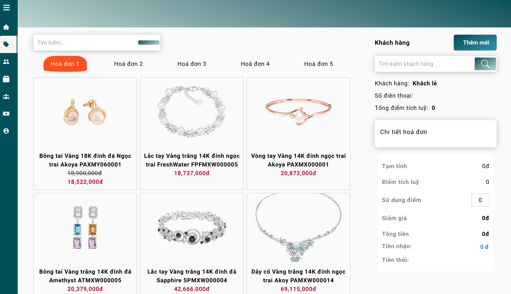

# Jewelry Business project

This project aim to create a staff management system for admin of a jewelry business website.


## Introduction
The staff management website is a comprehensive solution for jewelry business administrators to efficiently manage their staff members. It combines a frontend built with React and CSS for an interactive user interface. 

The Express backend handles server-side logic and routing, ensuring seamless communication between the frontend and backend components. The project incorporates various libraries and frameworks for enhanced functionality and utilizes development tools like React Scripts and ESLint for an efficient development workflow. 

Overall, it provides jewelry business admins with a user-friendly platform to streamline staff-related operations.
## Built with

**Client:** React, CSS

**Server:** Node, Express

The backend dependencies include: Argon2, CORS, dotenv, Express, JSONWebToken, and Mongoose.

**Development Tools:** React Scripts (version 5.0.1), Nodemon (version 2.0.16), ESLint (configurations for React)


## Overview



## Installation
**Prerequisites**
To clone and run this application, you'll need [Git](https://git-scm.com), [Node.js](https://nodejs.org/en/download/) (which comes with [npm](http://npmjs.com)), and [yarn](https://classic.yarnpkg.com/lang/en/docs/install/#mac-stable) installed on your computer. 

From your command line:

```bash
# Clone this repository
$ git clone https://github.com/PhamQuangHung-UIT/SE104.N23_Repos.git
```

## Run Locally
### Set up for frontend server

Go into the client folder
```bash
$ cd client
```

Install dependencies for frontend
```bash
$ npm install -f
```
Start the frontend development server
```bash
$ npm start
```

### Set up for backend server

Open another terminal, come to server folder
```bash
$ cd server
```

Install dependencies for backend
```bash
$ npm install 
```

Start the backend development server
```bash
$ yarn server
```
## Features

- Product Management:
    - Add new products
    - Edit existing product details
    - Delete products
    - Manage product categories and subcategories
    - Staff Account Management:

- View staff account information
    - Update staff account information
    - View staff details
    - Delete staff accounts
- Customer Management:

    - View customer details
    - Search for customers by name or email
    - Add new customers
    - Update customer information
    - Delete customers
- Bill Management:
    - Create new bills with itemized - lists - of - products and prices
    - Edit bills by adding or removing products and adjusting prices
    - Delete bills that are no longer needed
    - Mark bills as paid when payment is received
- Reporting:

    - Generate sales reports by product, category, or date range
    - Generate staff performance reports based on sales metrics
- User Account Management:

    - Browse product catalog
    - Search for products by keyword or  category
    - View product details, including images, descriptions, and specifications
    - Add products to cart
    - Update cart contents
    - Proceed to checkout and make payments
    - View order confirmation and receipt
